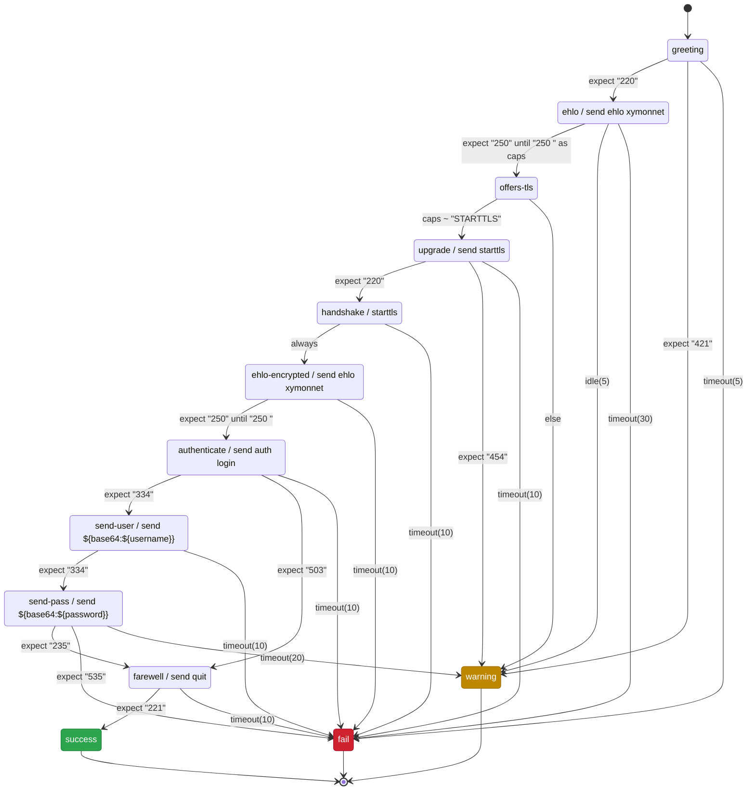

# Protocol dialogues: the reasoning, and what was not built

This note is for contributors. It records the designs that were tried and
rejected for the multi-step dialogues in `protocols.cfg`, so the same ground
is not re-explored -- which has already happened more than once here.

What the grammar *is*, and every decision an operator can observe, lives in
`xymonnet/protocols.cfg.5`, not here. The problem the feature exists to solve
is issue #457. This file holds the reasoning behind
that behaviour, and the counterfactuals: the alternatives, why they lost, and
what would change each verdict.

**Entries are permanent.** Anything reopened should be settled by amending its
entry rather than deleting it.

## The shape

```
[service|alias]
   transport tcp          entry attributes: transport, port, options, framing, ignore and start
   port N                 set properties of the definition, in any order
   options ssl,banner     among themselves
   framing line           how a message ends on this connection
   ignore "* "            a message the server sends unprompted
   begin NAME

   state NAME             names the state that follows, and is what an
                          edge aims at

      send "…"            ONE action -- send, starttls or credentials
      timeout(N) -> fail  the clock that bounds the wait
      expect "…" [ until "…" ] [ as NAME ]  -> TARGET
                          the alternatives that end the state, each
                          naming where its answer leads
```

```
condition ::= expect "…" [ until "…" ] [ as NAME ] | expect bytes(N) | NAME ~ "…"
            | else | always | eof | timeout(N) | idle(N)
```

**Targets** are a state, or one of `success`, `warning`, `fail` -- green, yellow, red. `warning` is the point: a server answering correctly but refusing an optional capability is not down, and calling it down teaches operators to ignore the column. An edge saying `fail` is red whatever `--checkresponse` is set to; a reply matching no alternative takes that option's colour, yellow by default.

**Layout.** Entry attributes -- `transport`, `port`, `options`, `framing`, `ignore`, `start` -- are written first, in any order among themselves, because they describe the definition rather than any step; then each `state` with its lines indented under it.

**One action, one wait.** A state does one thing -- a `send`, a `start tls`, a `credentials` -- and waits for one answer: the clock that bounds the wait, and the `expect` lines that end the state, each naming where its answer leads. A state that acts without waiting leaves on `always`; a state that decides on a value already bound needs no action at all. Because a state holds one action and one wait, the order of its lines carries no meaning of its own: the entry is declarative down to the state, and sequence lives in the edges between states rather than in the lines within one.

Most of this is now refused when the file is read: a state with two actions, a state that acts again after it has waited, a clock below the expects it should bound, an expect with no `-> TARGET`, a state named `success`/`warning`/`fail`, a second `options` line, and `until`/`as` on an entry the driver does not run. Each was decidable there all along, which is the standard this grammar set for itself when it gave up regex on `expect`. What is left unenforced is attribute placement and indentation -- both cosmetic, both checked by `tests/buildsystem/dialogue-conventions.sh` against every entry we ship or test. The classic shapes keep the old probe and none of this applies to them.

**Order is file order, and with one action per state that stops mattering.** The driver runs a state's lines as written and the first edge that fires leaves it, so today a `~` above an `expect` decides before the socket is read. An earlier draft specified a fixed precedence regardless of where lines were written and was rejected, because a precedence the reader cannot see is what turns a declaration back into a program. Under one action and one wait the question mostly dissolves: a state either decides on values it already holds or waits for bytes, and the two do not compete within one state. Where they still could, the honest fix is a load-time refusal rather than an invisible rule.

**Values are bound where they are produced.** `expect "…" as NAME` binds the reply that expect accepted; `NAME ~ "…" as X;Y` reads a bound value and binds more out of it. No line refers to its operand by position.

**Regex only ever reads a value already in hand.** That is what allows it on a `~` line and not on an `expect`: it decides nothing about what arrives, so it cannot race a partial read and needs no maximum match length.

## A worked example

Submission on 587, upgrading to TLS and authenticating:

```
[submission]
   port 587
   options banner
   credentials mysmtp
   begin greeting

   state greeting
      timeout(5)                  -> fail
      expect "220"                -> ehlo
      expect "421"                -> warning

   state ehlo
      send   "ehlo xymonnet\r\n"
      idle(5)                     -> warning
      timeout(30)                 -> fail
      expect "250" until "250 " as caps   -> offers-tls

   state offers-tls
      caps ~ "STARTTLS"           -> upgrade
      else                        -> warning

   state upgrade
      send   "starttls\r\n"
      timeout(10)                 -> fail
      expect "220"                -> handshake
      expect "454"                -> warning

   state handshake
      start tls
      timeout(10)                 -> fail
      always                      -> ehlo-encrypted

   state ehlo-encrypted
      send   "ehlo xymonnet\r\n"
      timeout(10)                 -> fail
      expect "250" until "250 "   -> authenticate

   state authenticate
      send   "auth login\r\n"
      timeout(10)                 -> fail
      expect "334"                -> send-user
      expect "503"                -> farewell

   state send-user
      send   "${base64:${username}}\r\n"
      timeout(10)                 -> fail
      expect "334"                -> send-pass

   state send-pass
      send   "${base64:${password}}\r\n"
      timeout(20)                 -> warning
      expect "235"                -> farewell
      expect "535"                -> fail

   state farewell
      send   "quit\r\n"
      timeout(10)                 -> fail
      expect "221"                -> success
```

The same entry as a diagram -- generated from it rather than drawn beside it: **25 edges in the config, 25 in the diagram.**



## Branching on a value

```
   state greeting
      timeout(5)                  -> fail
      expect "+OK" as banner      -> choose-auth
      expect "-ERR"               -> fail

   state choose-auth
      banner ~ "\+OK (\S+) (<[^>]+>)" as server;challenge
      challenge ~ "<"             -> apop
      else                        -> plain

   state apop
      send   "APOP ${username} ${md5:${challenge}${password}}\r\n"
      timeout(5)                  -> fail
      expect "+OK"                -> farewell
      expect "-ERR"               -> fail

   state plain
      send   "USER ${username}\r\n"
      timeout(5)                  -> fail
      expect "+OK"                -> send-pass
      expect "-ERR"               -> fail

   state send-pass
      send   "PASS ${password}\r\n"
      timeout(5)                  -> fail
      expect "+OK"                -> farewell
      expect "-ERR"               -> fail

   state farewell
      send   "quit\r\n"
      timeout(5)                  -> fail
      expect "+OK"                -> success
```

One entry, both server styles, no nesting. The greeting is bound where it is accepted and taken apart in the state that branches on it.

## The reasoning a manual has no room for

The behaviour itself is documented in `protocols.cfg(5)`, which ships with the code and is where an operator will look: what a state consumes and leaves, what `as` binds, the per-step budget and the idle clock, the 32 KB cap, the STARTTLS refusal over buffered data, the certificate off the upgraded session, that entering a state re-runs its action, and every complaint the parser makes about the file. Restating it there is how the two drifted apart twice, which is why the manual is the only place the behaviour is stated. What follows is the reasoning behind it.

**Why matching is literal, and nothing else is.** An unmatched reply fails at once rather than waiting out a timer, which is what makes a server that greets correctly and then rejects every command report promptly. That depends on "ruled out" being *decidably* ruled out: with alternatives `"220"` and `"221"`, a reply of `22` is unfinished rather than wrong, and both stay live until a byte decides. Prefix matching gives that at every byte. The same property makes the overlap check complete rather than heuristic -- prefix-anchored patterns collide iff one is a prefix of the other -- which is what lets the parser *refuse* an ambiguous group instead of warning about it. Both properties are lost the moment an `expect` can carry a regex, which is why one cannot.

**Why the graph checks are worth having, and how they mislead.** Three mistakes are properties of the graph rather than of any line: a state with no path to a terminal, an unreachable state, and a waiting state with no timer. All three are easy to implement too permissively, so they report nothing and look like they work -- reachability cannot simply follow the step list, and on the branch a `timeout(N) -> fail` edge briefly counted as ending the flow, which called every state after it unreachable. They are topology checks and should not be oversold: the bugs that cost time here are framing, partial reads and TLS transitions, and no topology check sees those.

**A hash is not enough.** `${md5:}` and `${base64:}` reach APOP and SASL PLAIN and stop there. CRAM-MD5 is an HMAC, MySQL's login is a SHA-1 chain, and the SCRAM family PostgreSQL, MongoDB and AMQP use is HMAC-SHA-256 -- none of them expressible by nesting a bare hash, however deeply, so a probe could reach the greeting of those services and never past it. `lib/digest.c` already implemented every digest they need, so what was missing was the reach: `${sha1:}` through `${sha512:}`, `${hmac-*:KEY,MESSAGE}` (RFC 2104 over the same digests), `${unbase64:}`, and `${hex:}`/`${len:}`, the two primitives the rest kept wanting -- a value the file cannot count for itself and one it cannot spell. CRAM-MD5 is the exchange that says which of those are load-bearing: RFC 2195 sends the challenge base64 and hashes it decoded, so `${unbase64:}` is not a convenience but the difference between the right digest and a plausible wrong one, and the decoder it needs has to return a length and honour `=` padding -- what it carries is a nonce, not a string. One name list serves both sides -- `dlg_expansion()` refuses a mistyped function when the file is read, `dlg_function()` runs it -- so the two cannot drift.

**Framing has two directions.** `framing length(W, ...)` taught the driver to read a message a count introduces, and left writing one to the file, which cannot do it: the count depends on how long an expanded `${...}` turns out to be, and that is not known until the step runs. A length-framed *request* carrying any value at all was therefore unwritable, and the framed protocols could be read from and never spoken to. The count is written by the driver instead, and a terminator appended, on the reading that framing describes the connection rather than one direction of it. `line` is left alone -- its entries have always written their own `\r\n`, and adding one would change every send that exists.

**What is not built.** Graph export (`--graph`) is deferred. A named state improves a failure from "step 7" to `state send-pass expected "235"`, and that is not enough: the faults that cost time are *why* it did not match -- bytes retained from the previous state, a reply matched before it was complete, a name that bound empty. A transcript mode is part of the feature and is **not implemented**. Nor is the marking it would require: `${password}` is expanded into a `send`, so the sent bytes, the buffer and anything an `as` binds may contain it. A value from `credentials.cfg` would have to be marked at binding time, stay marked through `${base64:}` and `${md5:}` -- an encoded secret is still the secret, and an APOP digest only looks opaque -- and be replaced by a placeholder in every output. The code wipes secrets from memory after use and no more, which is why it has no transcript to leak them into.

**`start FEATURE` names something the client does.** The word after it selects code here rather than a state, and is reserved -- `tls` is the only one, and anything else is refused when the file is read. It replaces `starttls`, which said one protocol's verb for a thing that is not protocol-specific: FTP calls it `AUTH TLS`, POP3 `STLS`, and the client action is the same in each.

**Why it is two words, and what a second one would cost.** `start tls` is not spelled as one word because the shape has to hold more than one feature. Three are already named and none is implemented: `start compress` for IMAP's `COMPRESS=DEFLATE`, which the earlier survey of what needs a keyword at all missed entirely; `start telnet` for option negotiation, which `options telnet` covers at connect but not mid-stream; and `start proxy` later. Each costs a reserved word and a code path, not a change to the shape of a state, because the binding rule is general: `start F` binds `${F_code}` and `${F_msg}`, so a second feature adds no grammar. Each is refused when the file is read if this build does not implement it, the way `transport` refuses anything but tcp -- so an entry written against a feature that is not here is rejected at load time rather than reported as a service fault.

**And parameters do not need to land on the `start` line.** An earlier draft of this note claimed an asymmetry -- that `options ssl` carried `alpn=` and `sni=` while the upgrade carried nothing -- and proposed `start tls sni=${host}` to fix it. The claim was wrong in both halves. `alpn=` is read inside `setup_ssl()` from the entry, and `start tls` calls that same `setup_ssl()`, so ALPN already applies to an upgraded session. And `sni=` is not an entry option at all: nothing in `protocols.cfg` parses it, and `item->sni` is set only by the HTTP tests, so no protocol probe has ever sent SNI -- implicit or upgraded. Because both paths share `setup_ssl()`, a parameter added where `alpn=` already lives reaches the upgrade without any new grammar, which is why `start` takes no parameters and does not need to.

**The missing SNI is a reporting bug, not a feature.** The certificate is read from the session to fill the `sslcert` column. A server hosting several names on one address answers a handshake that carries no server name with its default certificate, so the expiry Xymon reports for an smtps or imaps entry is whichever certificate that host happens to answer with, not the one the entry is named for. It is wrong quietly, and it looks authoritative. That makes `sni=` a correction to existing entries rather than a new capability.

**And it binds its outcome, because a failed upgrade is not one fact.** `start tls` binds two values: `${tls_code}`, which is `ok` or `failed`, and `${tls_msg}`, the reason OpenSSL gave up. Before, a server that agreed to STARTTLS and then failed the handshake ended the test red whatever the entry said, while a server that *refused* could be routed to `warning` by an ordinary `expect "454"` edge -- the same operational fact, TLS unusable and the service up, reportable in one case and not the other. Binding the result puts both on the same footing and needs no new condition keyword: the state that starts the feature branches with the `~` edges every other bound value uses, and an entry that tests nothing still fails, because no alternative matches and fail-fast ends it. It is two values rather than one because the two are not the same kind of thing. The message is OpenSSL's wording -- `error:0A00010B:SSL routines::wrong version number` -- which carries the punctuation of a diagnostic and changes between versions, locales and builds; routing on it means every entry writes a regex against text that can move under it, and `tls ~ "^ok"` only worked at all because "ok" happens not to appear in any failure string. The code is a closed vocabulary the driver owns, so entries decide on something stable and still have the reason to show an operator. Neither name may be taken by a capture: it would shadow the outcome, so it is refused.

**Not every message is an answer.** A protocol may speak unprompted -- IMAP's untagged lines, NNTP notices -- and a state waiting for a tagged reply would read one, fail to match it, and report a healthy server as broken. Fail-fast makes this worse rather than better: the faster the probe rules an answer out, the sooner it is wrong. `ignore PREFIX` says such a message is not an answer, so it is consumed and the wait continues. It could already be written as a self-loop on an action-less state, at the cost of an extra state per wait and a copy of every alternative in it; noise is a property of the protocol, so it belongs on the entry beside `framing`. Whether a message is noise is **positional**, not lexical: the alternatives of the current state are tried first, and a message is skipped only when none of them could be it. Refusing an ignored prefix that also starts an `expect` -- the first rule, by analogy with two overlapping alternatives -- was the wrong analogy, and it made the one protocol `ignore` exists for the one protocol it could not express: IMAP's greeting is itself an untagged `* OK` line, and the untagged lines that follow it are noise, and the two share their first seven characters. What it deliberately does not do is stop the clock: `idle` counts bytes and is satisfied by noise, `timeout` counts the wait and is not, so a server that says nothing but noise still fails.

**Three framings, because there are three ways a message ends.** `line` is the greeting protocols and `until` says where a multi-line *reply* stops within them. `length(W, endian)` is the protocols that count. `terminator "SEQ"` is everything else, and the one that makes a protocol of your own expressible: a message ends at a byte sequence wherever it falls, which `until` cannot say because it compares the start of a line. A custom protocol that ends records with a NUL, or with a blank line, or with a sentinel, needs no code -- it needs one attribute. What is deliberately absent is a read-granularity switch: how much the driver reads in one go changes no verdict, because matching is prefix-anchored and re-evaluated at every arrival, and consuming only the matched bytes is in the rejected list for breaking the ambiguity check.

**Framing is a property of the connection, not of a reply.** TCP has no message boundary; the protocol supplies one, and there are only three ways it ever does: a terminator (`until`), a count, or the close (`eof`). Where the count is how the protocol always works -- DNS-over-TCP, MySQL, LDAP, AMQP -- saying so on every `expect` would repeat one fact and would need arithmetic on a captured value, since the count is data the peer sends. `framing length(W, big|little)` states it once on the entry; the driver assembles each message and every rule already in the grammar keeps working on the message instead of on the byte stream. That also fixes the thing that makes binary protocols unreadable line-by-line: a `0x0A` inside a payload is data, and nothing scans for it. `until` and `bytes(N)` are refused under any framing but `line` -- length or terminator, the framing has spoken, and a second answer could only agree or contradict.

**A frame, not a line.** `expect bytes(N)` waits for N bytes and consumes exactly those. It is the one condition that is not decided by content, which is why it may not share a state with a literal: `expect bytes(3)` and `expect "220"` both accept the same three bytes and nothing in the file says which wins, so the group is refused. Two frames are worse -- the shorter always wins and the longer is dead. It exists because LDAP, MySQL, DNS-over-TCP and AMQP frame messages by length, and before it those services could be probed no further than their banner. It costs nothing the literal-only rule was buying: a length is decidable at every byte, exactly like a prefix.

## Prior art

| | Monit | blackbox_exporter | Expect | pexpect | here |
|---|---|---|---|---|---|
| form | config | config (YAML) | library | library | config |
| matching | regex | regex + `expect_bytes` | regex + literal | regex | literal only |
| branching | none | none | host `if` | host `if` | declarative edges |
| capture into a send | none | `${1}` positional | match object | match object | `${name}` named |
| per-step timeout | none | none | per `expect` | per call | `timeout(N)` |
| idle vs total clock | no | no | `restart_timeout_upon_receive` | no | `idle(N)` / `timeout(N)` |
| starttls | compiled | step field | host code | host code | step |
| verdict | pass/fail | pass/fail | n/a | n/a | green / yellow / red |

Literal-only matching is the one place this is *less* expressive than all four, and it is deliberate: it is what makes overlap decidable and fail-fast possible.

## Explorations that were rejected

Each entry says what was tried, why it lost, and where one exists, what would change it.

**A regex-matching `expect`.** `expect-regex "…" -> TARGET`. Rejected because it breaks load-time decidability twice. Overlap between two literals is decidable and complete; between two PCRE2 patterns it is *undecidable* (backreferences and recursion put PCRE2 outside the regular languages), so one alternative could silently shadow another. And it reintroduces a fixed bug: alternatives used to be decided by packet boundaries, and the fix defers the decision until the buffer is as long as the longest pattern -- which needs a maximum match length that a regex has none of. Would change if restricted to a regular dialect *and* given a computable maximum match length.

**A separate `capture` step.** `capture as X` / `capture-regex "…" as X;Y` as their own lines, binding out of the *preceding* expect's reply. Built, shipped in the draft, removed. It was the only line naming its operand by position, and it failed silently: the guard could only ask whether the entry had any expect at all, so a capture written one state too late bound the *earlier* state's reply -- wrong rather than missing. Two examples in this document were written that way and neither was noticed until the grammar changed.

**Binding a value inside `expect`.** The regex form -- `expect /\+OK .*(<[^>]+>)/ as challenge` -- stays rejected: it puts a regex on the line that reads the socket. **Amended after building it:** the plain `expect "…" as NAME` was adopted, binding the whole consumed reply with no regex. What survives of the objection: a name bound on one alternative is not bound on another, so the check can only say a name is bound *somewhere* in the entry.

**An `expect-capture` keyword.** Rejected: it multiplies with the clauses `expect` already carries -- `expect-until`, `expect-capture`, `expect-until-capture`, one per combination. A clause composes where a keyword does not, and `until` was already the precedent.

**Deferring an ambiguous group instead of refusing it.** Built, tested, removed: once regex alternatives were dropped the collision check became complete, so refusing rejects nothing valid, while deferral made every *healthy* probe wait for the longest pattern's worth of bytes.

**Consuming only the matched bytes rather than the whole line.** More composable, and how Expect works. Rejected: splitting an overlap across two states leaves the checker confirming each group is internally clean while missing that the pair was one ambiguous group. Would change if the checker could follow a split chain.

**A catch-all `otherwise`.** Rejected: no worked example needed it; the prefix case it was for is answered by `as` plus a decision state; it is a second spelling of `else`; and fail-fast already supplies the default. Would change if a state needed a catch-all *without* binding the reply first.

**Folding `until` into a line-scanning `expect`.** Rejected: it silently makes `expect` line-oriented, putting `[ajp13]`, `[rdp]` and `[amqp]` -- whose patterns contain no newline -- permanently out of reach, and it fuses *where did the reply end* with *was it good*.

**A `when NAME ~ REGEX` / `else` / `end` block.** Branching as a nested block, the enclosed steps running only when the value matched. Never implemented -- the parser has only ever taken `~` and `else` as edges -- but it outlived the draft it came from and sat in `protocols.cfg(5)` describing a grammar nothing accepted, beside `goto` and a bare `fail`. Rejected on its own merits too: a block hides where a state ends, and nesting is the point at which a config becomes a program. Recorded here because a draft that survives in the manual is indistinguishable, to a reader, from a decision.

**`banner` as a feature, or a way to report one bound value.** Considered making the banner a `start` feature, and adding a `report NAME` that publishes one bound value instead of everything. Neither is needed: the banner is a state. `options banner` is the pre-dialogue mechanism -- read one thing and show it -- from when an entry was a single exchange, and a dialogue says the same thing as `state greeting / expect "220" as greeting`. Extraction is already complete, since `as NAME` and `NAME ~ "..." as X;Y` reach any substring of any reply; display is already complete, since the banner callback appends on every read and so publishes the whole server side of the conversation. Routing and display are each covered, and selecting a subset for display is cosmetic. A `start` feature would fail its own test besides: it must change what later bytes mean and have an outcome that can be routed, and a banner does neither -- `${banner_code}` would be `ok` forever, which is an option, not a feature. Two properties follow from the all-or-nothing flag and are documented rather than fixed: an entry that authenticates either leaves the banner off or accepts that a server quoting a failed login stores that reply, and the accumulated banner has no size cap, unlike the 32 KB dialogue read buffer.

**`starttls` as a bare verb.** One word, no argument, no result. Replaced by `start tls`: the upgrade is a client feature rather than a protocol keyword, the two-word form leaves room for the parameters the session needs (`sni=`, and whatever follows), and a feature that can fail should say how -- which a verb with no value cannot. The entry attribute `start NAME` was renamed `begin NAME` to free the word; `begin greeting` also reads better than `start greeting` for "the state to begin in".

**`goto TARGET` for edges.** Replaced by `->`: nothing jumps, the machine moves, and `goto` was the most program-like word in the grammar.

**Terminal states named as colours.** `-> green` instead of `-> success`. Tried and reverted: the colour is how Xymon renders the outcome, not the outcome.

**A default `timeout N` applying to following states.** Rejected: that is exactly the positional behaviour the shape removes.

**An explicit `expect-any … end` block.** Not needed once states are named: the state *is* the group.

**Reusable state blocks.** Rejected: it makes the config a macro language, and a shared destination is already reachable by an edge. Revisit if entries start repeating large blocks verbatim.

**Renaming `send` and `expect`** to `say`/`on`/`read`/`bind`. Rejected: those two words are the shared vocabulary of Monit, blackbox_exporter, Expect, pexpect, telnetlib and `chat(8)`; renaming discards the field's convergence for a purity only we would notice.

**Mealy: the action on the transition.** Rejected: a state reachable from several places would duplicate its action on every incoming edge -- `farewell` already has two routes in.

**One thing per state.** More uniform, and makes timers structural. *Rejected, then adopted.* The objection was that with one action and one wait the sequence is forced rather than authored, that an action-only state carries no information when its single edge is `always ->`, and that it cost 17 states against 10 on the submission entry, with failures reading `state send-pass-wait expected "235"` where `-wait` is scaffolding. What overturned it: a state holding several actions and several waits makes line order significant *inside* a state, and that is what stops the file being declarative -- a clock written below an expect bounds nothing, a `~` above one decides before the socket is read. One action and one wait moves all sequence into the edges, where it is visible and checkable, and makes "this state waits twice" and "this clock bounds nothing" load-time questions. The cost is the extra states, which is a cost in reading, not in meaning.

**Mermaid as the config format itself.** Tested rather than assumed -- labels do preserve trailing spaces, `\r\n` and colons. Rejected: it needs a mermaid-subset parser in C, and a subset is the trap; it pins the config to someone else's release cycle; its edge list names both endpoints per line, so a state's action sits away from its edges; and `[name]`, `options`, `port` have no home in it. Generating mermaid gets the benefit with none of that.

**A transport flag on a single grammar.** Superseded: a ping body has nothing in common with a dialogue body, and stretching one grammar over both is how a config language bloats. Hence `transport`, with only `tcp` implemented and anything else refused rather than silently treated as tcp.

## The linear form

Three independent reviews recommended a **reduced linear form** -- ordered steps
with optional labels, no named states as edge targets -- arguing that ordering
fixes the first problem in #457, multi-step the second and bound values the
third, while the graph checks are only topology checks. That argument is largely
right and deserves an answer rather than a dismissal.

It stops one step short. A linear form covers all three *for a single server*,
and `protocols.cfg` does not describe a single server: one definition is a
column across the estate. A fleet whose servers are configured differently --
some offering APOP, some STARTTLS -- forces a linear entry down to what they all
do, which is the shallow check the feature exists to remove. Branching is not a
fourth feature; it is what makes the fix hold for more than one host.

What would move this: a demonstration that the shipped services are homogeneous
enough in practice that a linear definition does not degrade.

## A caution

Ten bugs in the original branch were found by running probes against real
servers, none by source-level tests. Four were invisible on plain TCP and fatal
with `options ssl`; one broke *legacy* services the feature does not touch;
three were state that existed in one representation and did not survive into the
next, including an uninitialised field that aborted the probe whenever three
dialogue services ran together; two were reports naming the wrong line. Whatever
lands here needs behavioural tests over TLS, not assertions about the code.
