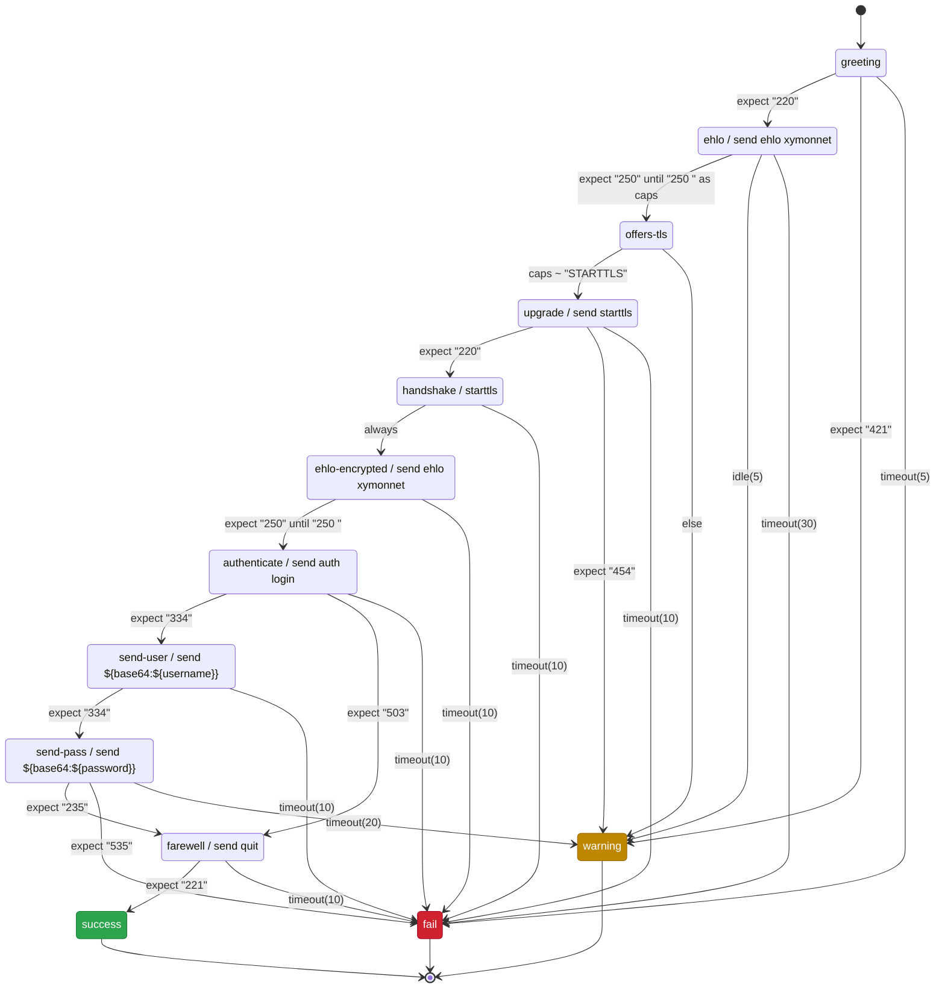

# Protocol dialogues: the reasoning, and what was not built

This note is for contributors. It records the designs that were tried and
rejected for the multi-step dialogues in `protocols.cfg`, so the same ground
is not re-explored -- which has already happened more than once here.

What the grammar *is*, and every decision an operator can observe, lives in
`xymonnet/protocols.cfg.5`, not here. The problem the feature exists to solve
is issue #457. This file holds the reasoning behind
that behaviour, and the counterfactuals: the alternatives, why they lost, and
what would change each verdict.

**Entries are permanent.** Anything reopened should be settled by amending its
entry rather than deleting it.

## The shape

```
[service|alias]
   transport tcp          entry attributes. transport, port, options and
   port N                 start set properties of the definition; the
   options ssl,banner     order among them does not matter.
   start NAME

   state NAME             names the steps that follow, and is what an
                          edge aims at

      credentials NAME    everything from here is a STEP, and steps run
      send "…"            in the order they are written
      starttls
      expect "…" [ until "…" ] [ as NAME ]
      NAME ~ "…" as X;Y   read a bound value, bind more out of it
      <condition> -> TARGET               an edge; the first that fires leaves
```

```
condition ::= expect "…" [ until "…" ] [ as NAME ] | NAME ~ "…"
            | else | always | eof | timeout(N) | idle(N)
```

**Targets** are a state, or one of `success`, `warning`, `fail` -- green, yellow, red. `warning` is the point: a server answering correctly but refusing an optional capability is not down, and calling it down teaches operators to ignore the column. An edge saying `fail` is red whatever `--checkresponse` is set to; a reply matching no alternative takes that option's colour, yellow by default.

**Layout.** Entry attributes -- `transport`, `port`, `options`, `start` -- are written first, because they describe the definition rather than any step; then each `state` with its steps indented under it. A state holds as many steps as the exchange needs, and an `expect` with no `->` continues with the step below it, so one state can wait, send and read again before anything decides. The parser enforces none of this: an attribute is accepted anywhere in the block and indentation is ignored. It is how every example here and in `protocols.cfg(5)` is written.

**Order is file order.** A state's lines run as written and the first edge that fires leaves, so a `~` above an `expect` decides before the socket is read at all. An earlier draft specified a fixed precedence regardless of where lines were written; the implementation does not do that and should not, because a precedence the reader cannot see is what turns a declaration back into a program.

**Values are bound where they are produced.** `expect "…" as NAME` binds the reply that expect accepted; `NAME ~ "…" as X;Y` reads a bound value and binds more out of it. No line refers to its operand by position.

**Regex only ever reads a value already in hand.** That is what allows it on a `~` line and not on an `expect`: it decides nothing about what arrives, so it cannot race a partial read and needs no maximum match length.

## A worked example

Submission on 587, upgrading to TLS and authenticating:

```
[submission]
   port 587
   options banner
   credentials mysmtp
   start greeting

   state greeting
      expect "220"                -> ehlo
      expect "421"                -> warning
      timeout(5)                  -> fail

   state ehlo
      send   "ehlo xymonnet\r\n"
      expect "250" until "250 " as caps   -> offers-tls
      idle(5)                     -> warning
      timeout(30)                 -> fail

   state offers-tls
      caps ~ "STARTTLS"           -> upgrade
      else                        -> warning

   state upgrade
      send   "starttls\r\n"
      expect "220"                -> handshake
      expect "454"                -> warning
      timeout(10)                 -> fail

   state handshake
      starttls
      always                      -> ehlo-encrypted
      timeout(10)                 -> fail

   state ehlo-encrypted
      send   "ehlo xymonnet\r\n"
      expect "250" until "250 "   -> authenticate
      timeout(10)                 -> fail

   state authenticate
      send   "auth login\r\n"
      expect "334"                -> send-user
      expect "503"                -> farewell
      timeout(10)                 -> fail

   state send-user
      send   "${base64:${username}}\r\n"
      expect "334"                -> send-pass
      timeout(10)                 -> fail

   state send-pass
      send   "${base64:${password}}\r\n"
      expect "235"                -> farewell
      expect "535"                -> fail
      timeout(20)                 -> warning

   state farewell
      send   "quit\r\n"
      expect "221"                -> success
      timeout(10)                 -> fail
```

The same entry as a diagram -- generated from it rather than drawn beside it: **25 edges in the config, 25 in the diagram.**



## Branching on a value

```
   state greeting
      expect "+OK" as banner      -> choose-auth
      expect "-ERR"               -> fail
      timeout(5)                  -> fail

   state choose-auth
      banner ~ "\+OK (\S+) (<[^>]+>)" as server;challenge
      challenge ~ "<"             -> apop
      else                        -> plain

   state apop
      send   "APOP ${username} ${md5:${challenge}${password}}\r\n"
      expect "+OK"                -> farewell
      expect "-ERR"               -> fail
      timeout(5)                  -> fail

   state plain
      send   "USER ${username}\r\n"
      expect "+OK"                -> send-pass
      expect "-ERR"               -> fail
      timeout(5)                  -> fail

   state send-pass
      send   "PASS ${password}\r\n"
      expect "+OK"                -> farewell
      expect "-ERR"               -> fail
      timeout(5)                  -> fail

   state farewell
      send   "quit\r\n"
      expect "+OK"                -> success
      timeout(5)                  -> fail
```

One entry, both server styles, no nesting. The greeting is bound where it is accepted and taken apart in the state that branches on it.

## The reasoning a manual has no room for

The behaviour itself is documented in `protocols.cfg(5)`, which ships with the code and is where an operator will look: what a state consumes and leaves, what `as` binds, the per-step budget and the idle clock, the 32 KB cap, the STARTTLS refusal over buffered data, the certificate off the upgraded session, that entering a state re-runs its action, and every complaint the parser makes about the file. Restating it there is how the two drifted apart twice, which is why the manual is the only place the behaviour is stated. What follows is the reasoning behind it.

**Why matching is literal, and nothing else is.** An unmatched reply fails at once rather than waiting out a timer, which is what makes a server that greets correctly and then rejects every command report promptly. That depends on "ruled out" being *decidably* ruled out: with alternatives `"220"` and `"221"`, a reply of `22` is unfinished rather than wrong, and both stay live until a byte decides. Prefix matching gives that at every byte. The same property makes the overlap check complete rather than heuristic -- prefix-anchored patterns collide iff one is a prefix of the other -- which is what lets the parser *refuse* an ambiguous group instead of warning about it. Both properties are lost the moment an `expect` can carry a regex, which is why one cannot.

**Why the graph checks are worth having, and how they mislead.** Three mistakes are properties of the graph rather than of any line: a state with no path to a terminal, an unreachable state, and a waiting state with no timer. All three are easy to implement too permissively, so they report nothing and look like they work -- reachability cannot simply follow the step list, and on the branch a `timeout(N) -> fail` edge briefly counted as ending the flow, which called every state after it unreachable. They are topology checks and should not be oversold: the bugs that cost time here are framing, partial reads and TLS transitions, and no topology check sees those.

**What is not built.** Graph export (`--graph`) is deferred. A named state improves a failure from "step 7" to `state send-pass expected "235"`, and that is not enough: the faults that cost time are *why* it did not match -- bytes retained from the previous state, a reply matched before it was complete, a name that bound empty. A transcript mode is part of the feature and is **not implemented**. Nor is the marking it would require: `${password}` is expanded into a `send`, so the sent bytes, the buffer and anything an `as` binds may contain it. A value from `credentials.cfg` would have to be marked at binding time, stay marked through `${base64:}` and `${md5:}` -- an encoded secret is still the secret, and an APOP digest only looks opaque -- and be replaced by a placeholder in every output. The code wipes secrets from memory after use and no more, which is why it has no transcript to leak them into.

## Prior art

| | Monit | blackbox_exporter | Expect | pexpect | here |
|---|---|---|---|---|---|
| form | config | config (YAML) | library | library | config |
| matching | regex | regex + `expect_bytes` | regex + literal | regex | literal only |
| branching | none | none | host `if` | host `if` | declarative edges |
| capture into a send | none | `${1}` positional | match object | match object | `${name}` named |
| per-step timeout | none | none | per `expect` | per call | `timeout(N)` |
| idle vs total clock | no | no | `restart_timeout_upon_receive` | no | `idle(N)` / `timeout(N)` |
| starttls | compiled | step field | host code | host code | step |
| verdict | pass/fail | pass/fail | n/a | n/a | green / yellow / red |

Literal-only matching is the one place this is *less* expressive than all four, and it is deliberate: it is what makes overlap decidable and fail-fast possible.

## Explorations that were rejected

Each entry says what was tried, why it lost, and where one exists, what would change it.

**A regex-matching `expect`.** `expect-regex "…" -> TARGET`. Rejected because it breaks load-time decidability twice. Overlap between two literals is decidable and complete; between two PCRE2 patterns it is *undecidable* (backreferences and recursion put PCRE2 outside the regular languages), so one alternative could silently shadow another. And it reintroduces a fixed bug: alternatives used to be decided by packet boundaries, and the fix defers the decision until the buffer is as long as the longest pattern -- which needs a maximum match length that a regex has none of. Would change if restricted to a regular dialect *and* given a computable maximum match length.

**A separate `capture` step.** `capture as X` / `capture-regex "…" as X;Y` as their own lines, binding out of the *preceding* expect's reply. Built, shipped in the draft, removed. It was the only line naming its operand by position, and it failed silently: the guard could only ask whether the entry had any expect at all, so a capture written one state too late bound the *earlier* state's reply -- wrong rather than missing. Two examples in this document were written that way and neither was noticed until the grammar changed.

**Binding a value inside `expect`.** The regex form -- `expect /\+OK .*(<[^>]+>)/ as challenge` -- stays rejected: it puts a regex on the line that reads the socket. **Amended after building it:** the plain `expect "…" as NAME` was adopted, binding the whole consumed reply with no regex. What survives of the objection: a name bound on one alternative is not bound on another, so the check can only say a name is bound *somewhere* in the entry.

**An `expect-capture` keyword.** Rejected: it multiplies with the clauses `expect` already carries -- `expect-until`, `expect-capture`, `expect-until-capture`, one per combination. A clause composes where a keyword does not, and `until` was already the precedent.

**Deferring an ambiguous group instead of refusing it.** Built, tested, removed: once regex alternatives were dropped the collision check became complete, so refusing rejects nothing valid, while deferral made every *healthy* probe wait for the longest pattern's worth of bytes.

**Consuming only the matched bytes rather than the whole line.** More composable, and how Expect works. Rejected: splitting an overlap across two states leaves the checker confirming each group is internally clean while missing that the pair was one ambiguous group. Would change if the checker could follow a split chain.

**A catch-all `otherwise`.** Rejected: no worked example needed it; the prefix case it was for is answered by `as` plus a decision state; it is a second spelling of `else`; and fail-fast already supplies the default. Would change if a state needed a catch-all *without* binding the reply first.

**Folding `until` into a line-scanning `expect`.** Rejected: it silently makes `expect` line-oriented, putting `[ajp13]`, `[rdp]` and `[amqp]` -- whose patterns contain no newline -- permanently out of reach, and it fuses *where did the reply end* with *was it good*.

**`goto TARGET` for edges.** Replaced by `->`: nothing jumps, the machine moves, and `goto` was the most program-like word in the grammar.

**Terminal states named as colours.** `-> green` instead of `-> success`. Tried and reverted: the colour is how Xymon renders the outcome, not the outcome.

**A default `timeout N` applying to following states.** Rejected: that is exactly the positional behaviour the shape removes.

**An explicit `expect-any … end` block.** Not needed once states are named: the state *is* the group.

**Reusable state blocks.** Rejected: it makes the config a macro language, and a shared destination is already reachable by an edge. Revisit if entries start repeating large blocks verbatim.

**Renaming `send` and `expect`** to `say`/`on`/`read`/`bind`. Rejected: those two words are the shared vocabulary of Monit, blackbox_exporter, Expect, pexpect, telnetlib and `chat(8)`; renaming discards the field's convergence for a purity only we would notice.

**Mealy: the action on the transition.** Rejected: a state reachable from several places would duplicate its action on every incoming edge -- `farewell` already has two routes in.

**One thing per state.** More uniform, and makes timers structural. Rejected: with one action and one wait the sequence is forced rather than authored; the action state carries no information, its only edge being `always ->`; and it costs 17 states against 10 on the submission entry, with failures reading `state send-pass-wait expected "235"` where `-wait` is scaffolding. The split form is still correct wherever a state is the target of a cycle, since re-entry re-runs the action.

**Mermaid as the config format itself.** Tested rather than assumed -- labels do preserve trailing spaces, `\r\n` and colons. Rejected: it needs a mermaid-subset parser in C, and a subset is the trap; it pins the config to someone else's release cycle; its edge list names both endpoints per line, so a state's action sits away from its edges; and `[name]`, `options`, `port` have no home in it. Generating mermaid gets the benefit with none of that.

**A transport flag on a single grammar.** Superseded: a ping body has nothing in common with a dialogue body, and stretching one grammar over both is how a config language bloats. Hence `transport`, with only `tcp` implemented and anything else refused rather than silently treated as tcp.

## The linear form

Three independent reviews recommended a **reduced linear form** -- ordered steps
with optional labels, no named states as edge targets -- arguing that ordering
fixes the first problem in #457, multi-step the second and bound values the
third, while the graph checks are only topology checks. That argument is largely
right and deserves an answer rather than a dismissal.

It stops one step short. A linear form covers all three *for a single server*,
and `protocols.cfg` does not describe a single server: one definition is a
column across the estate. A fleet whose servers are configured differently --
some offering APOP, some STARTTLS -- forces a linear entry down to what they all
do, which is the shallow check the feature exists to remove. Branching is not a
fourth feature; it is what makes the fix hold for more than one host.

What would move this: a demonstration that the shipped services are homogeneous
enough in practice that a linear definition does not degrade.

## A caution

Ten bugs in the original branch were found by running probes against real
servers, none by source-level tests. Four were invisible on plain TCP and fatal
with `options ssl`; one broke *legacy* services the feature does not touch;
three were state that existed in one representation and did not survive into the
next, including an uninitialised field that aborted the probe whenever three
dialogue services ran together; two were reports naming the wrong line. Whatever
lands here needs behavioural tests over TLS, not assertions about the code.
